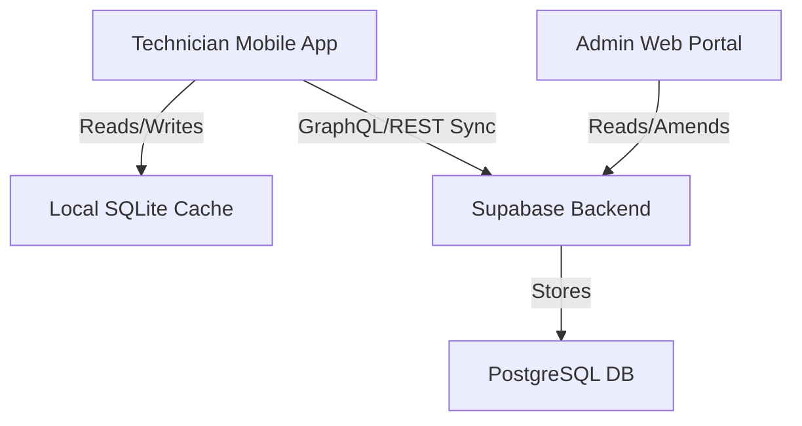

# GIAL Daily Service Reporting (DSR) System

The GIAL Daily Service Reporting (DSR) System is a multi-platform application designed for Guwahati International Airport to track, manage, and reconcile daily equipment logs and verification tests (EVK) for airport security scanners.

It provides a React Web Admin Portal for administrators and an Expo React Native Mobile App for field technicians, integrated with a Supabase backend and SQLite offline storage capability.

---

## Table of Contents
- [Tech Stack](#tech-stack)
- [Architecture Overview](#architecture-overview)
- [Prerequisites](#prerequisites)
- [Getting Started](#getting-started)
- [Environment Variables](#environment-variables)
- [Available Scripts](#available-scripts)
- [Database Schema](#database-schema)
- [Testing](#testing)
- [Deployment](#deployment)

---

## Tech Stack

| Component | Technology | Description |
|---|---|---|
| **Shared Backend** | **Supabase** | Authentication, database, row-level security (RLS), and API layer. |
| **Web Admin Portal** | **React / Vite / TypeScript / GSAP** | Administrative dashboard with staggered transitions and data exports. |
| **Mobile Client** | **Expo / React Native / Reanimated** | Field technician client featuring offline SQLite caching and tactile spring animations. |
| **Database (Server)**| **PostgreSQL** | Relational data store hosted on Supabase. |
| **Database (Client)**| **SQLite** | Local database (`expo-sqlite`) for offline reports storage. |

---

## Architecture Overview



### Directory Structure
```
├── packages/
│   ├── mobile/         # React Native Expo application for field technicians
│   │   ├── src/lib/    # SQLite engine and synchronization service
│   │   └── src/screens/# Mobile screens (Login, MachineList, ReportEntry)
│   └── web/            # React Vite web administration portal
│       └── src/        # Admin dashboard, custom select, and Excel exports
├── supabase/           # Migrations, seed data, and configuration
└── README.md
```

---

## Prerequisites

- **Node.js** v20.x or higher
- **npm** or **npx** (v10.x+)
- **Supabase CLI** (for local backend development)

---

## Getting Started

### 1. Clone the Repository
```bash
git clone <repository-url>
cd gial-dsr
```

### 2. Configure Environment Variables
Copy the templates and configure the Supabase credentials:
```bash
# In packages/web
cp packages/web/.env.example packages/web/.env

# In packages/mobile
cp packages/mobile/.env.example packages/mobile/.env
```

### 3. Initialize Supabase Backend
Start the local Supabase environment (Docker required) and run migrations:
```bash
supabase start
```

### 4. Install Dependencies
Run the installation command in the packages:
```bash
# Install Web Portal dependencies
cd packages/web && npm install

# Install Mobile App dependencies
cd ../mobile && npm install
```

### 5. Run Development Servers
Start dev servers from the workspace root directory:
```bash
# Start Web Portal
npm run dev:web

# Start Mobile App (Metro bundler)
npm run dev:mobile
```

---

## Environment Variables

### Web Portal (`packages/web/.env`)
| Variable | Description |
|---|---|
| `VITE_SUPABASE_URL` | Supabase project endpoint |
| `VITE_SUPABASE_ANON_KEY` | Supabase anonymous API key |

### Mobile App (`packages/mobile/.env`)
| Variable | Description |
|---|---|
| `EXPO_PUBLIC_SUPABASE_URL` | Supabase project endpoint |
| `EXPO_PUBLIC_SUPABASE_ANON_KEY` | Supabase anonymous API key |

---

## Available Scripts

Run these scripts from the project root using `npm run <script>`:

| Command | Workspace Location | Description |
|---|---|---|
| `dev:web` | `packages/web` | Start the Vite local server (Web Portal) |
| `dev:mobile` | `packages/mobile` | Start the Metro Bundler (Mobile App) |
| `dev:supabase` | `supabase` | Start the Supabase local instance |
| `build:web` | `packages/web` | Compile and build the Web Portal for production |
| `build:mobile` | `packages/mobile` | Export the Mobile App bundler static assets |
| `lint` | Workspace-wide | Lint both mobile and web codebases |
| `typecheck` | Workspace-wide | Compile and check TypeScript types without emitting code |
| `test` | Workspace-wide | Run Jest tests (mobile) and Vitest tests (web) |

---

## Database Schema

- **`public.sites`**: Airport sites mapping.
- **`public.profiles`**: Extended user attributes (`role: admin | sysadmin | technician`).
- **`public.machines`**: Equipment inventory (`model: Itemiser 4DX | IONSCAN 500DT`).
- **`public.daily_reports`**: Core report database (immutable, daily composite keys).
- **`public.pending_sync`**: Queue of offline reports awaiting network reconciliation.
- **`public.machine_compliance`**: Ni-63 source leak checks and license deadlines.
- **`public.corrections`**: Audit log of administrative updates to existing daily reports.

---

## Testing

```bash
# Run web portal tests
cd packages/web && npm run test

# Run mobile app tests
cd packages/mobile && npm run test
```

---

## Deployment

### Web Admin Portal
Deploy the built output of `packages/web/dist` directly to host providers (e.g., **Vercel**, **Netlify**, or **Render**).

### Mobile App
Build a standalone binary using EAS Build or export via Expo Export:
```bash
cd packages/mobile && npx expo export
```
Deploy index files and HBC bundles to a static server or publish on the Expo Go ecosystem.

### Database / Backend
Configure Supabase and apply local migrations upstream:
```bash
supabase db push
```
